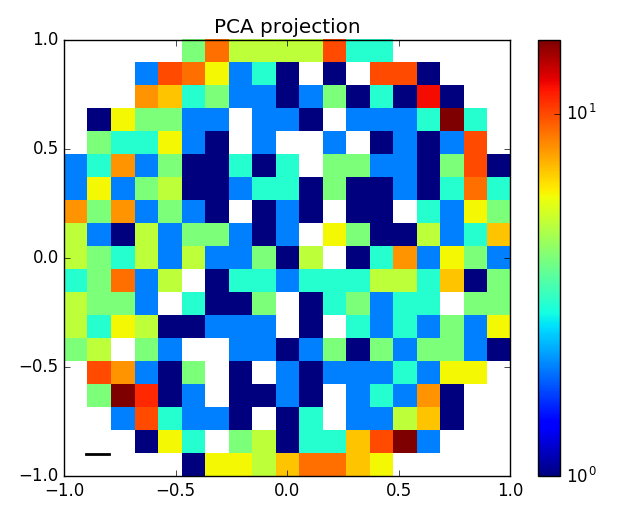
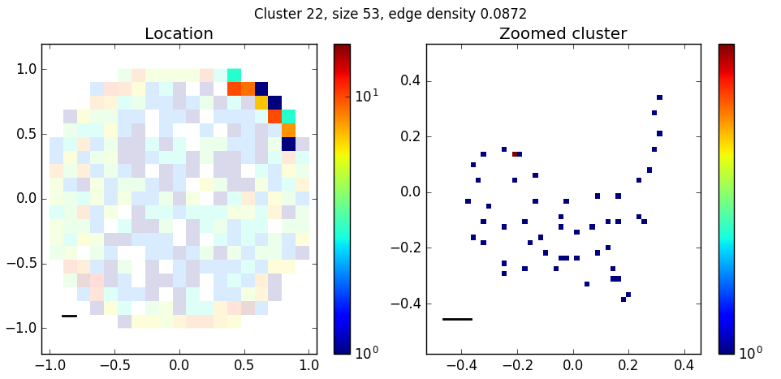
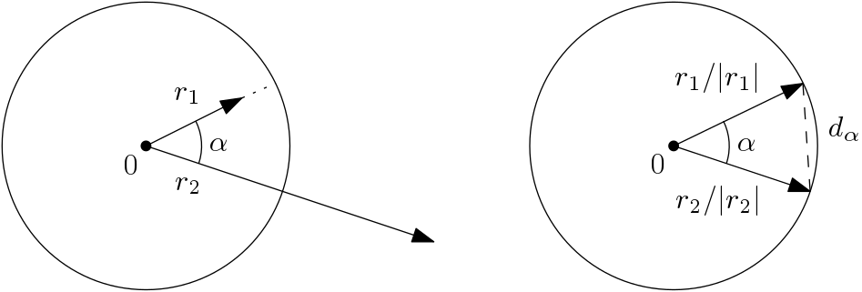

SIngle-LInkage CONnectivity clustering
======================================

A Python library for a fast approximation of
`single-linkage clustering <https://en.wikipedia.org/wiki/Single-linkage_clustering>`_ with
given eclidean distance or cosine similarity threshold.
Supports both dense arrays (numpy) and sparse matrices (scipy).
Also offers simple cluster visualisation with matplotlib.

This module grew into a separate library strating as an data exploratory project
in `CZ.NIC labs <https://labs.nic.cz/en/>`_ to cluster captured honeypot records.

Github: `CZ-NIC/silicon-clustering <https://github.com/CZ-NIC/silicon-clustering>`_

PyPI: `silicon-clustering <https://pypi.python.org/pypi?name=silicon-clustering>`_

Author: Tomáš Gavenčiak, gavento@ucw.cz

.. toctree::
   :maxdepth: 2
   :caption: Contents:
   :hidden:

   api

Usage
-----

::

    import silicon, numpy
    # use a fixed seed to get the same data
    rnd = numpy.random.RandomState(42)
    # create some data
    data = rnd.uniform(-1.0, 1.0 ,(1000, 3))
    # create and run the clustering instance
    c = silicon.CosineClustering(data, rnd=rnd, sim_threshold=0.995)
    c.run()
    print(c.clusters())

    import matplotlib.pyplot as plt
    # plot the data overview
    c.plot()
    plt.show()
    # plot the largest cluster
    c.clusters_by_size()[0].plot()
    plt.show()

Algorithm
---------

Given a matrix, the algorithm computes row clusters with the condition
that any two rows with cosine similarity above a given threshold (resp.
with euclidean distance below a threshold) belong to the same cluster.
This corresponds to connected components of the graph over the rows where
two rows are connected if similar (or close) enough.

All the distance computation and vector operations are done by numpy and scipy
to speed up the computation and save some memory.

Cosine similarity
+++++++++++++++++

The cosine similarity computation is transformed to an instance of the
euclidean distance by normalizing the row vector lengths and computing the
threshold distance:

Euclidean distance
++++++++++++++++++

Rather than computing the distance of all row pairs, the algorithm
projects the rows into *k*-dimensional grid of cubes ("cells") of side *d* - the
threshold distance. The projection basis is selected as the *k* most
principal PCA vectors. The projection has the property that only the rows in
adjacent cells may be in distance less than *d* and we only check all pairs of
these.

For sparse point configurations, this is already fast enough, but with uneven
point distribution and dense areas, this can still be slow. A further optimization
is a nibble procedure done before dividing the points into cells:

Randomly sample a point and compute the distance to all others, joining
the clusters of close rows. If this hits a dense area, most of the points there are
clustered in one scan. Most points clustered in this way are excluded from the
all-pair computation, but some are included to allow the nibbled clusters to be extended
with other (non-nibbled) clusters if appropriate. The rule is to return 10% rows per
cell, at least 100 (if possible) and at most 1000.
See :py:meth:`silicon.CosineClustering.compute_cell_mask` for details.

Excluding most of the nibbled rows from pairwise distance computation may lead
to missing some clustering links (e.g. between a point with just a single close
point that has is on the border of a nibbled sphere), but our experiments have
shown this to be unlikely -- in dense areas, there are usually many alternative
links joining the clusters, and in sparse cells, all the rows are considered.

Indices and tables
==================

* :ref:`genindex`
* :ref:`modindex`
* :ref:`search`
